# Demo

Krystal Quorum can be tried without API keys by using the deterministic `mock` reviewer.



## Weak Plan

```bash
krystal-quorum review examples/bad-plan.md --reviewers mock
```

Expected result:

```json
{
  "verdict": "REVISE",
  "reviewers_used": ["mock"],
  "diversity": "ok"
}
```

The mock reviewer flags the missing acceptance criteria and exits with code `1`.

## Fixed Plan

```bash
krystal-quorum review examples/good-plan.md --reviewers mock
```

Expected result:

```json
{
  "verdict": "APPROVE",
  "reviewers_used": ["mock"],
  "diversity": "ok"
}
```

The fixed plan includes acceptance criteria, so the mock reviewer exits with code `0`.

## Agent Integration

Install project-local prompts or skills:

```bash
krystal-quorum init --target claude-code
krystal-quorum init --target hermes
krystal-quorum init --target openclaw
```

Use `mock` only to prove the flow. Real plan review should use diverse local, API, or command reviewers.
